# Inception of Things


## Description
This project aims to introduce you to Kubernetes from a developer's perspective. You will have to set up small clusters and discover the mechanics of continuous integration. At the end of this project, you will be able to set up a working cluster in Docker and have a usable continuous integration pipeline for your applications.

## Vagrant
Vagrant is the command line utility for managing the lifecycle of virtual machines. Isolate dependencies and their configuration within a single disposable and consistent environment.

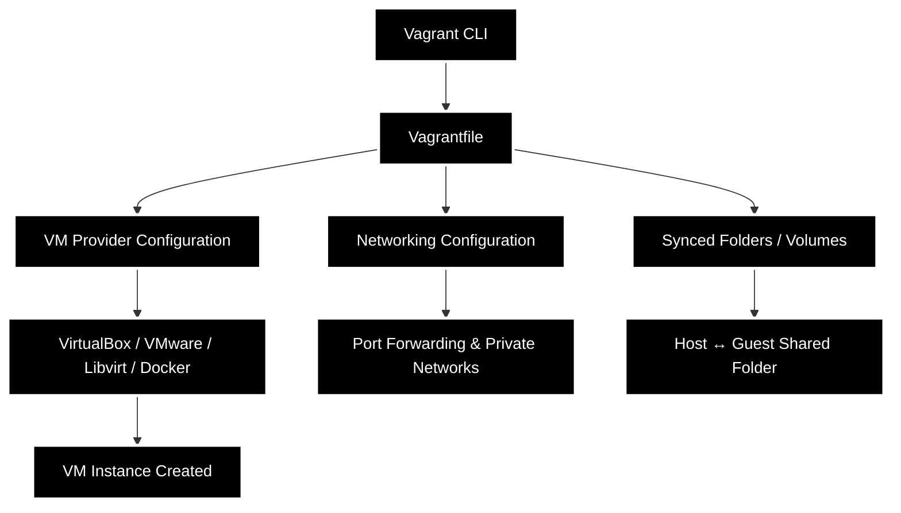
```mermaid
flowchart TD
    A[Vagrant CLI] --> B[Vagrantfile]
    B --> C[VM Provider Configuration]
    B --> D[Networking Configuration]
    B --> E[Synced Folders / Volumes]
    C --> F[VirtualBox / VMware / Libvirt / Docker]
    F --> G[VM Instance Created]
    D --> H[Port Forwarding & Private Networks]
    E --> I[Host ↔ Guest Shared Folder]

    style A fill:#000,stroke:#fff,stroke-width:3px,color:#fff
    style B fill:#000,stroke:#fff,stroke-width:3px,color:#fff
    style C fill:#000,stroke:#fff,stroke-width:3px,color:#fff
    style D fill:#000,stroke:#fff,stroke-width:3px,color:#fff
    style E fill:#000,stroke:#fff,stroke-width:3px,color:#fff
    style F fill:#000,stroke:#fff,stroke-width:3px,color:#fff
    style G fill:#000,stroke:#fff,stroke-width:3px,color:#fff
    style H fill:#000,stroke:#fff,stroke-width:3px,color:#fff
    style I fill:#000,stroke:#fff,stroke-width:3px,color:#fff
```

## kurbernetes (k8s)
is an open-source platform for automating deployment, scaling, and operation of containerized applications.

Key ideas:
* It manages containers across multiple machines.
* Ensures high availability and scalability.
* Provides self-healing (restart containers if they fail, reschedule them if nodes die).
* Offers service discovery and load balancing automatically.

### Kubernetes Architecture Overview
#### Control Plane (Master)
It manages the cluster state.

Key components:
1. **API Server (kube-apiserver)**:
The front door of Kubernetes.
Receives REST API requests (from kubectl, other components).
Validates and processes requests.
2. **etcd**:
A key-value store for Kubernetes cluster state.
Stores configurations, cluster state, secrets, etc.
Think of it as the cluster’s memory.
3. **Controller Manager (kube-controller-manager)**:
* Ensures desired state matches the actual state.
* Controllers include:
  * Node Controller → monitors node health.
  * Replication Controller → ensures correct number of pods.
  * Endpoint Controller → manages network endpoints.
4. **Scheduler (kube-scheduler):**
* Assigns workloads (pods) to nodes.
* Decides which node can run a pod based on resources, policies, and constraints.
5. **Cloud Controller Manager (optional if using cloud)**:
* Integrates cloud-specific services (like AWS, GCP, Azure).
* Manages load balancers, node lifecycles, storage, etc.

#### Node (Worker) Plane
Nodes are where your applications actually run.

Key components:
1. **kubelet**:
* Agent running on each node.
* Communicates with API server.
* Ensures containers in pods are running.

2. **Container Runtime**:
* Software that runs containers (Docker, containerd, CRI-O).
* Kubelet uses this to launch containers.

3. **kube-proxy**:
* Handles networking for pods.
* Implements service abstraction and load balancing.
* Ensures pods can communicate inside and outside the cluster.

4. **Pods**:
* Smallest deployable unit in Kubernetes.
* A pod can contain one or more containers.
* Pods are ephemeral (they can die and be recreated).

### Kubernetes Objects
Objects are persistent entities in Kubernetes. They describe the desired state.

1. **Pod** → Single/multi-container unit.

2. **ReplicaSet** → Ensures certain number of pod replicas exist.

3. **Deployment** → Declarative way to manage ReplicaSets and rollouts.

4. **StatefulSet** → Manages stateful applications (like databases).

5. **DaemonSet** → Runs a pod on every node (useful for logging, monitoring).

6. **Service** → Provides stable IPs and DNS for pods, load balancing.

7. **ConfigMap** & Secret → Store configuration and sensitive info.

8. **Ingress** → Exposes HTTP/HTTPS routes to services from outside.


### Kubernetes services
what is exactly a service in kubernetes and why do we need it ??

in a kubernetes cluster, every pod gets its own internal IP address. but here’s the problem: pods are ephemeral — they get destroyed and recreated often (for example, during scaling, upgrades, or failures). every time a pod restarts, it usually gets a new IP address. this makes it nearly impossible to track and connect to a specific pod reliably.

that’s why we need a Service. a service in kubernetes gives you a stable, permanent IP and DNS name that stays the same, no matter if the underlying pods come and go. clients never connect to pods directly — they connect to the service, and the service forwards traffic to the right pods.

bonus: a service also does basic load balancing by default, distributing traffic across all the pods it selects.
---
there are several types of services in kubernetes. pods are connected to a service through its selector attribute in the service’s manifest file. this selector matches the labels on the pods.
```yaml
apiVersion: v1
kind: Service
metadata:
  name: my-service
spec:
  selector:               # this matches pods with label app=my-app
    app: my-app
  ports:
    - protocol: TCP
      port: 80
      targetPort: 8080    # forwards traffic to container port 8080
  type: ClusterIP
```
if a pod has:
```yaml
metadata:
  labels:
    app: my-app
```
then it will automatically be picked up by my-service

---
#### ClusterIP: 
this is the default type of service. it exposes the service inside the cluster only. other pods can reach it, but it won’t be available from outside the cluster.
`type: ClusterIP`
you use this for typical backend services (e.g., your frontend app talks to your backend service).

#### Headless Service:
sometimes, clients actually need to talk directly to individual pods, instead of going through the load balancer. this usually happens in stateful applications like databases.

example scenario: imagine you have a database cluster with one master node and multiple worker nodes. when a new worker pod starts, it has to connect directly to the master pod to clone its state. here you need pod-to-pod discovery.

how do you get pod IPs?

1. one option: query the kubernetes API directly and fetch all pods. but this makes your app too dependent on kubernetes internals.

2. better option: use DNS. by default, a DNS lookup for a service returns the service ClusterIP. but if you set clusterIP: None (making it headless), then a DNS lookup returns all the pod IPs that match the service selector.

```yaml
apiVersion: v1
kind: Service
metadata:
  name: db-service
spec:
  clusterIP: None   # makes it headless
  selector:
    app: my-db
  ports:
    - port: 5432
```
if you run a DNS query for db-service.default.svc.cluster.local, you’ll get back all the pod IPs for the database. now each worker node can find and connect directly to the master.

#### NodePort:
a NodePort service exposes your application on each node’s IP address at a static port.
that means if you have a cluster with 3 nodes, your service will be accessible from:
```ruby
<Node1IP>:<NodePort>
<Node2IP>:<NodePort>
<Node3IP>:<NodePort>
```

```yaml
apiVersion: v1
kind: Service
metadata:
  name: my-app-nodeport
spec:
  type: NodePort
  selector:
    app: my-app
  ports:
    - port: 80
      targetPort: 8080
      nodePort: 30007   # the static port opened on each node
```
this way, even without ingress or a cloud load balancer, you can hit the service directly on that port from outside the cluster.

#### LoadBalancer:
this is commonly used when running in a cloud environment (like AWS, GCP, Azure, DigitalOcean, etc.). when you create a service of type LoadBalancer, kubernetes talks to the cloud provider’s APIs and provisions a real external load balancer for you.

the external load balancer gets a public IP address, and all incoming requests to that IP are automatically forwarded to the service, and from there to the pods.
```yaml
apiVersion: v1
kind: Service
metadata:
  name: my-app-lb
spec:
  type: LoadBalancer
  selector:
    app: my-app
  ports:
    - port: 80
      targetPort: 8080
```
in AWS this might spin up an ELB, in GCP a forwarding rule, etc. — but from your perspective it’s just an external IP that routes traffic into your pods.

<!-- what is exactly a service in kubernetes and why do we need it ??
in kubernetes cluster each pod gets its own internal ip address but the pods in kubernetes are ephumerel which means they're destroyed frequently and when restarted they get a new ip which meakes it hard to track the exact pod

with a service you have a stable ip address which stays even if the pod dies and you only contact the service. a service also provides a loadbalancer by default 

there is several types of services in kubernetes 
pods are identified to a service throught its selected attribute in the manifest file (explain this a bit more with an examples simple snippets )

* **ClusterIP**: this is a default type of a service. 
* **Headless**: what if the client wantto talk to a pod directly whitout a pod. this stat can happen when we are deploying statefull applications like db, mongodb ..., as an examples and explain the examples in a geneoin way simply in the case of two dbs one in master and worker nodes when a new wokrer node starts it has to connect to the master and clone the db stat for this scenario to happen the client has to know each pod ip address there is two ways of doing that one it making a request to the api server and getting all the pods info and they're ips but this will make the application too tied to the k8s api and yo have to get all the pods info everytime. second option is dns lookup how tis work is when performing a dns lookup it only returns the ip address of a service and this will be the service clustesIP. but if you specify the clusterIP attribute to none when performing a dns lookup it will return all the pod ip that are related to that specfic service give an examples snippet 
* **NodePort**:  createsa  service that is accessible one each pod in the cluster as an example other services do no allow access to pods except through the service itself but in nodeport it opens a port directly to the pod explain in better way  so this way the request comes directly throught the prot with no ingres 
* **LoadBalancer**: how it works is the service becomes available externaly through a cloudprovided loadbalancer functionality (explain in a bit more details)  -->

### Ingress
<!-- Ingress is a Kubernetes API object that exposes HTTP and HTTPS routes from outside the cluster to services running inside. It provides a single entry point for managing external access, simplifying application management and routing.

in ingress configutayion you have routing rules which defines per example all the requests sent to a specific host should be routed to a specific service (add a more detailed explaination also explain each attribute in its configuration definition) -->

an Ingress is a kubernetes api object that manages external access to services inside your cluster, usually over http and https.

instead of exposing every service individually with NodePort or LoadBalancer, ingress gives you a single entry point into the cluster. from there you can define routing rules (e.g., “all traffic for api.example.com goes to service A, and all traffic for web.example.com goes to service B”).

this makes ingress extremely powerful for microservices, where you might have dozens of services but want to expose them all under one domain with clean paths or subdomains.

---
**how ingress works**

1. you define an Ingress resource (a yaml manifest with rules, hosts, paths, etc.).

2. the ingress resource doesn’t do anything by itself — you need an Ingress Controller (like Nginx, Traefik, HAProxy, or cloud-specific ones).

3. the ingress controller watches for ingress objects and configures the load balancer / proxy to follow the rules you defined.

---
```yaml
apiVersion: networking.k8s.io/v1
kind: Ingress
metadata:
  name: my-app-ingress
  annotations:
    nginx.ingress.kubernetes.io/rewrite-target: /
spec:
  ingressClassName: nginx
  rules:
  - host: web.example.com
    http:
      paths:
      - path: /
        pathType: Prefix
        backend:
          service:
            name: web-service
            port:
              number: 80
  - host: api.example.com
    http:
      paths:
      - path: /
        pathType: Prefix
        backend:
          service:
            name: api-service
            port:
              number: 80
```

**attributes explained**

* **apiVersion**: for ingress objects it’s usually networking.k8s.io/v1 (current stable version).

* **kind**: always Ingress.

* **metadata**: includes name, namespace, and optionally annotations. annotations are extra configuration options understood by the ingress controller (like rewrite rules, ssl redirect, rate limiting, etc.).

* **spec**:

  * **ingressClassName**: tells kubernetes which ingress controller should handle this object (e.g., nginx, traefik).
  * **rules**: this is where routing happens.
    * **host**: the domain name you want to expose.
      * **http.paths**:
        * **path**: the URL path to match (like /, /api, /login).
        * **pathType**: how the path is matched (Prefix, Exact, or ImplementationSpecific).
        * **backend.service.name**: the service name inside the cluster that should receive the traffic.
        * **backend.service.port.number**: which port of the service to send requests to.
there’s also tls configuration, which lets you terminate https traffic at the ingress:
```yaml
tls:
- hosts:
  - web.example.com
  secretName: web-tls-secret
```
this means the ingress controller will use the tls certificate stored in the secret web-tls-secret to handle https for web.example.com.

---
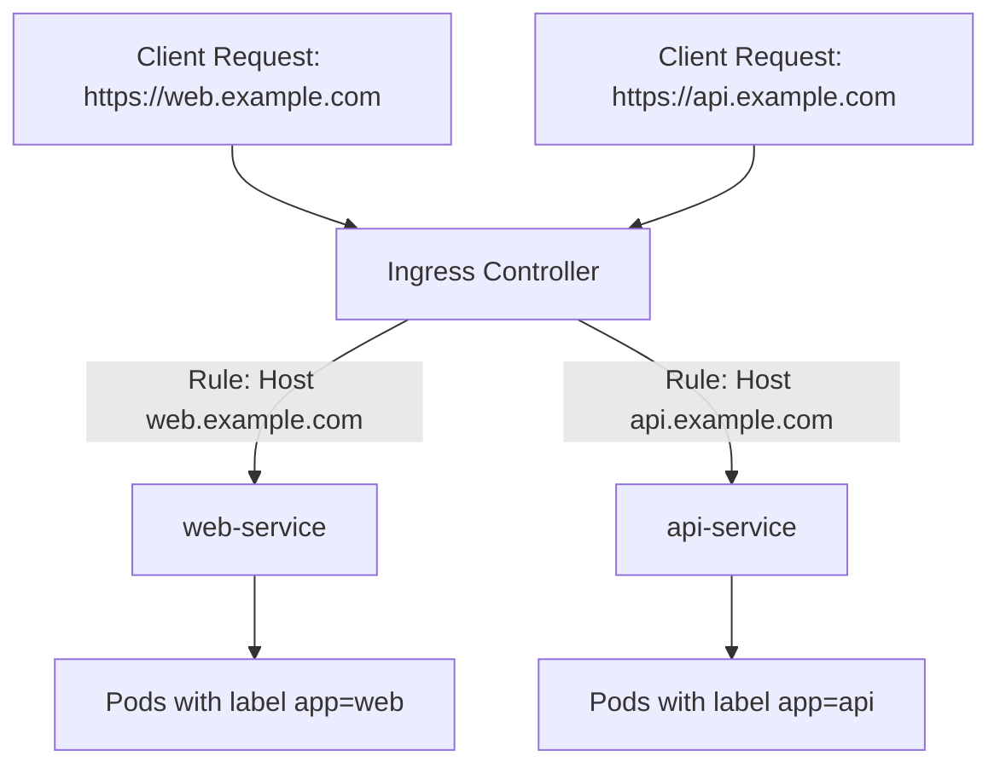
```mermaid
graph TD
    A[Client Request: https://web.example.com] --> B[Ingress Controller]
    B -->|Rule: Host web.example.com| C[web-service]
    A2[Client Request: https://api.example.com] --> B
    B -->|Rule: Host api.example.com| D[api-service]
    C --> E[Pods with label app=web]
    D --> F[Pods with label app=api]
```


### Kubernetes Networking
Kubernetes networking has 3 fundamental rules:
1. Every pod gets a unique IP.

2. Pods can communicate with other pods without NAT.

3. Agents (like kube-proxy) handle service IPs and load balancing.

**Networking components:**
* **Pod network** → Direct communication between pods.

* **Service network** → Load-balances traffic to pods.

* **Ingress controller** → Manages external HTTP/S traffic.

* **CNI plugins** → Networking solutions like Calico, Flannel, Weave, etc.

**Traffic flow examples:**
* **Pod** → **Pod**: direct IP routing.

* **Pod** → **Service**: kube-proxy redirects traffic to available pods.

* **External** → **Service** → Pod: via NodePort or LoadBalancer or Ingress.

### Kubernetes Workflow
Here’s a high-level view of how Kubernetes manages workloads:

1. Developer creates a Deployment object (desired state) via API Server.

2. Scheduler decides which node should run the pods.

3. kubelet on the node instructs the container runtime to launch containers.

4. Controller Manager ensures the number of pods matches the desired replicas.

5. kube-proxy ensures networking and service discovery.

6. If a pod dies:

   * Controller Manager notices and requests API server to recreate it.

   * Scheduler finds a node to launch a new pod.

7. etcd always stores the current state for recovery.


### High-Level Diagram (Mermaid)

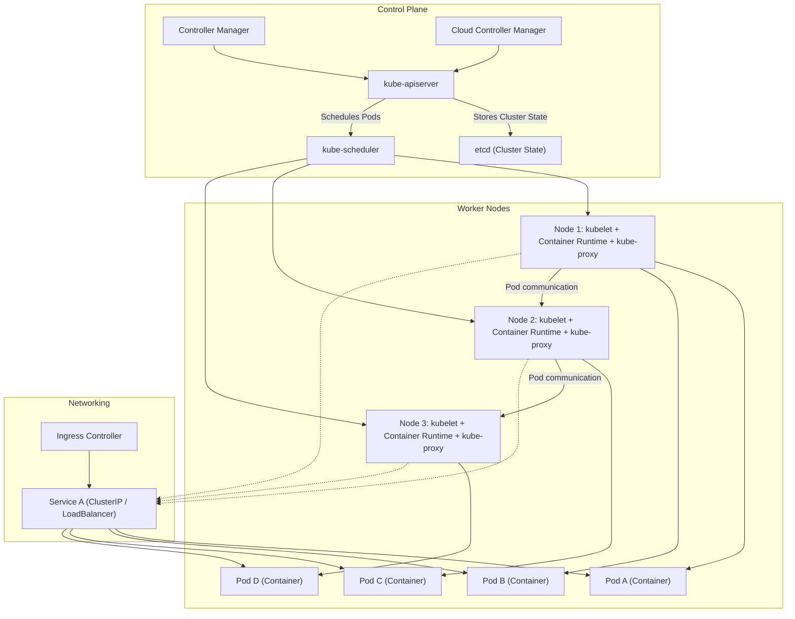
```mermaid
flowchart TD
    %% Control Plane
    subgraph CONTROL_PLANE["Control Plane"]
        APIServer["kube-apiserver"]
        ETCD["etcd (Cluster State)"]
        Scheduler["kube-scheduler"]
        Controller["Controller Manager"]
        CloudController["Cloud Controller Manager"]
    end

    %% Worker Nodes
    subgraph NODES["Worker Nodes"]
        Node1["Node 1: kubelet + Container Runtime + kube-proxy"]
        Node2["Node 2: kubelet + Container Runtime + kube-proxy"]
        Node3["Node 3: kubelet + Container Runtime + kube-proxy"]

        PodA["Pod A (Container)"]
        PodB["Pod B (Container)"]
        PodC["Pod C (Container)"]
        PodD["Pod D (Container)"]

        Node1 --> PodA
        Node1 --> PodB
        Node2 --> PodC
        Node3 --> PodD
    end

    %% Networking
    subgraph NETWORK["Networking"]
        ServiceA["Service A (ClusterIP / LoadBalancer)"]
        Ingress["Ingress Controller"]
    end

    %% Control plane connections
    APIServer -->|Stores Cluster State| ETCD
    APIServer -->|Schedules Pods| Scheduler
    Scheduler --> Node1
    Scheduler --> Node2
    Scheduler --> Node3
    Controller --> APIServer
    CloudController --> APIServer

    %% Node and networking connections
    Node1 -->|Pod communication| Node2
    Node2 -->|Pod communication| Node3
    Node1 -.-> ServiceA
    Node2 -.-> ServiceA
    Node3 -.-> ServiceA
    Ingress --> ServiceA
    ServiceA --> PodA
    ServiceA --> PodB
    ServiceA --> PodC
    ServiceA --> PodD
```

## kurbernetes (k8s) Simplified Diagram
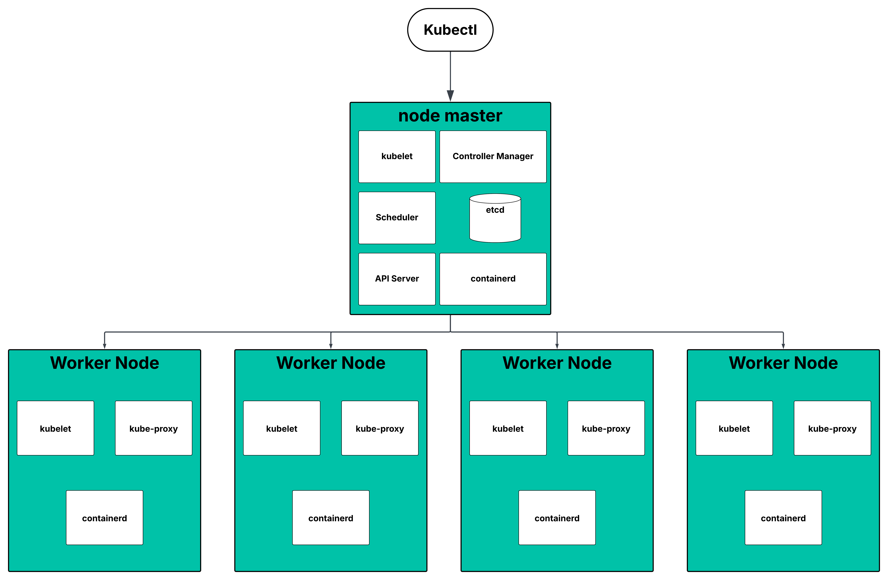


## K3S
K3s is a highly available, certified Kubernetes distribution designed for production workloads in unattended, resource-constrained, remote locations or inside IoT appliances.
### K3s Architecture Overview
K3s keeps Kubernetes’ core concepts but merges or simplifies components.

1. **Control Plane**: Server (Control Plane node):

* Combines API Server, Scheduler, Controller Manager, and etcd (or SQLite by default).

* Optionally runs embedded datastore (SQLite) instead of external etcd.

* Single node can act as master and worker for small setups.

2. **Worker Nodes**: Agent Node:

* Runs kubelet + container runtime.

* Communicates with the K3s server to run pods.

K3s defaults to containerd instead of Docker for running containers.


## Kubernetes YAML File Explained 
each configuration file in kubernetes usually has 3 main parts:

the first one is the **metadata**. this section describes basic info about the object you are creating like its name, namespace, and any labels or annotations you want to attach. metadata is mostly just identification and organization.

the second part is the **specification** (written as spec). this is where you actually tell kubernetes what you want the object to look like. for example, in a deployment spec you can say how many replicas you want, which container image to use, what ports should be exposed, and so on. basically, spec is the “desired state.”

the third part is the **status**. unlike the other two, you don’t write this part yourself. kubernetes generates it automatically when the resource runs. it shows the “current state” of the object and it is continuously updated. kubernetes always compares the status against the spec (the desired state) and makes changes to bring the cluster into alignment. all of this info is stored in etcd, the internal database that kubernetes uses.

---
what is deployment ??

a deployment is a kubernetes object that manages pods for you. instead of creating pods directly, you define a deployment and kubernetes takes care of creating them, restarting them if they fail, and keeping the right number of replicas running.

in the configuration file, a deployment has a template section. this template is basically a pod definition nested inside the deployment. it describes things like the container image to run, its name, which ports it opens, and the labels it uses.

labels are super important here: they’re how kubernetes keeps track of which pods belong to which deployment. if you scale a deployment from 2 replicas to 5, kubernetes will spin up new pods with the same labels as the template.

an example deployment yaml:

```yaml
apiVersion: apps/v1
kind: Deployment
metadata:
  name: my-app-deployment
  labels:
    app: my-app
spec:
  replicas: 3
  selector:
    matchLabels:
      app: my-app
  template:
    metadata:
      labels:
        app: my-app
    spec:
      containers:
      - name: my-app-container
        image: nginx:latest
        ports:
        - containerPort: 80
```
and for the selector part, it is mainly used in a service configuration to link (or better yet, match) it to a deployment’s pods. when you create a service, you tell it which pods it should send traffic to by giving it a selector that matches the pod labels.

in addition to the selector, the service also configures ports: which port it will listen on and which port inside the pod it should forward requests to.

an example service yaml:
```yaml
apiVersion: v1
kind: Service
metadata:
  name: my-app-service
spec:
  selector:
    app: my-app
  ports:
    - protocol: TCP
      port: 80        # port exposed by the service
      targetPort: 80  # port inside the pod
  type: ClusterIP     # exposes internally within the cluster
```
---
a simple diagram showing how all these pieces connect together:
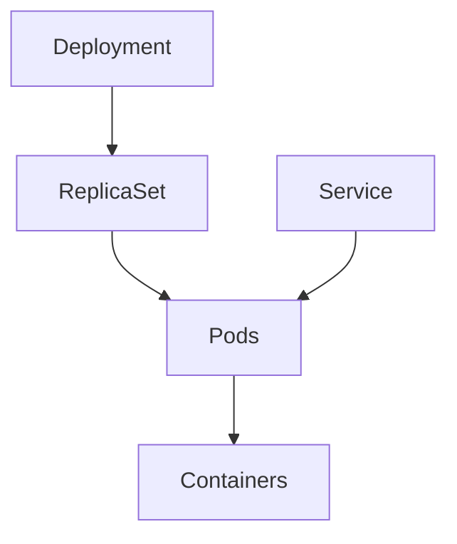
```mermaid
graph TD
    A[Deployment] --> B[ReplicaSet]
    B --> C[Pods]
    C --> D[Containers]
    E[Service] --> C
```


<!-- each configuration file in kubernetes has 3 part
The first one is the **Metadata** and the second part is **specification** the first lines are youst a description of whaat you want to create. and the third part would be **status** and its automatically generated and added by kubernetes after the run and its compared to that saved stat in etcd and the status is updated continuously 

what is deployment ??
deployment manages the pods that are below them and in the configuration file is have a template part which in itself holds the configuration file for pods that it manages and these information are what ports are open on a container and what is its name and so on also we use labels to track the pods that are created by a certain deployment 

and for the selector part its mainly used on a service config to link it or better yet match it to a deployment another thing that is configured is the ports of the services which ports it will forward the request to and which port it will receive requests in.  -->

## ArgoCD

### What is ArgoCD

ArgoCD is a **declarative, GitOps continuous delivery tool** for Kubernetes. It follows the GitOps methodology where Git repositories serve as the single source of truth for defining the desired application state.

ArgoCD continuously monitors Git repositories for changes and automatically synchronizes the live state in your Kubernetes cluster to match the desired state defined in Git.

**Key Characteristics:**
- **Declarative**: You define *what* you want, not *how* to achieve it
- **Git-native**: Uses Git as the source of truth for application definitions
- **Kubernetes-native**: Runs inside Kubernetes and uses Kubernetes APIs
- **Real-time**: Continuously monitors and syncs state differences

### Why ArgoCD? its use cases

#### **Traditional vs GitOps Deployment**


```mermaid
flowchart TD
    subgraph TRADITIONAL["Traditional CI/CD"]
        Dev1[Developer] --> Git1[Git Push]
        Git1 --> CI1[CI Pipeline]
        CI1 --> Build1[Build & Test]
        Build1 --> Deploy1[Direct Deploy to K8s]
        Deploy1 --> K8s1[Kubernetes Cluster]
    end

    subgraph GITOPS["GitOps with ArgoCD"]
        Dev2[Developer] --> Git2[Git Push]
        Git2 --> CI2[CI Pipeline]
        CI2 --> Build2[Build & Push Image]
        Build2 --> Update[Update Manifest in Git]
        Update --> ArgoCD[ArgoCD Monitors]
        ArgoCD --> Sync[Auto Sync]
        Sync --> K8s2[Kubernetes Cluster]
    end

    style TRADITIONAL fill:#000,stroke:#fff,stroke-width:3px,color:#fff
    style GITOPS fill:#000,stroke:#fff,stroke-width:3px,color:#fff
```

#### **Use Cases:**

1. **Multi-Environment Management**
   - Development, Staging, Production environments
   - Each environment tracked by separate Git branches/repos
   - Consistent deployment process across all environments

2. **Multi-Cluster Deployments**
   - Deploy same application across multiple Kubernetes clusters
   - Centralized management from single ArgoCD instance
   - Cross-cluster application synchronization

3. **Security & Compliance**
   - No direct cluster access needed for deployments
   - All changes tracked in Git (audit trail)
   - Role-based access control through Git permissions

4. **Disaster Recovery**
   - Entire cluster state stored in Git
   - Quick cluster reconstruction from Git repositories
   - Version-controlled infrastructure as code

### How ArgoCD works && benefits

#### **ArgoCD Architecture**

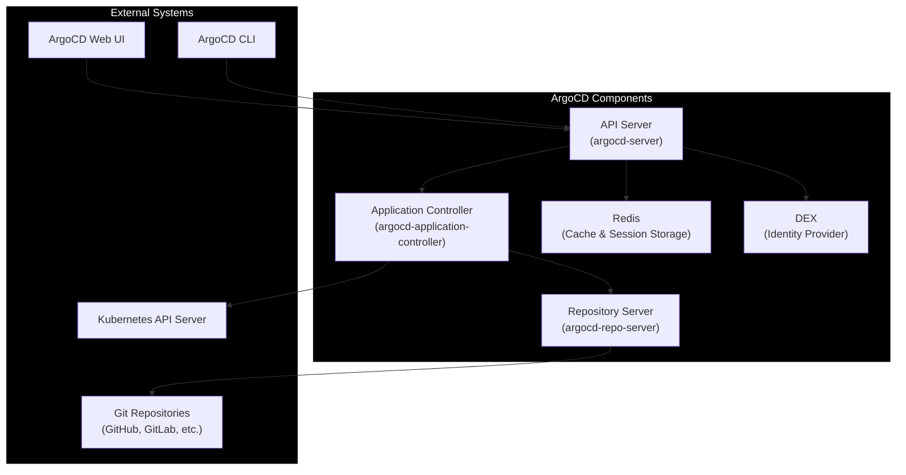
```mermaid
flowchart TD
    subgraph ARGOCD["ArgoCD Components"]
        APIServer["API Server<br>(argocd-server)"]
        RepoServer["Repository Server<br>(argocd-repo-server)"]
        AppController["Application Controller<br>(argocd-application-controller)"]
        Redis["Redis<br>(Cache & Session Storage)"]
        DEX["DEX<br>(Identity Provider)"]
    end

    subgraph EXTERNAL["External Systems"]
        Git["Git Repositories<br>(GitHub, GitLab, etc.)"]
        K8sAPI["Kubernetes API Server"]
        WebUI["ArgoCD Web UI"]
        CLI["ArgoCD CLI"]
    end

    %% Connections
    WebUI --> APIServer
    CLI --> APIServer
    APIServer --> Redis
    APIServer --> DEX
    APIServer --> AppController
    AppController --> RepoServer
    AppController --> K8sAPI
    RepoServer --> Git

    style ARGOCD fill:#000,stroke:#fff,stroke-width:3px,color:#fff
    style EXTERNAL fill:#000,stroke:#fff,stroke-width:3px,color:#fff
```

#### **Core Components Explained:**

1. **API Server (argocd-server)**
   - Exposes REST/gRPC API and Web UI
   - Handles authentication and authorization
   - Serves as the main interface for users and CLI

2. **Repository Server (argocd-repo-server)**
   - Maintains local cache of Git repositories
   - Generates Kubernetes manifests from various sources (Helm, Kustomize, plain YAML)
   - Handles Git operations (clone, fetch, checkout)

3. **Application Controller (argocd-application-controller)**
   - Monitors applications and compares live state vs desired state
   - Performs synchronization operations
   - Manages application lifecycle and health checks

4. **Redis**
   - Caches repository data and application state
   - Stores user sessions and temporary data
   - Improves performance by reducing Git operations

#### **GitOps Workflow with ArgoCD**

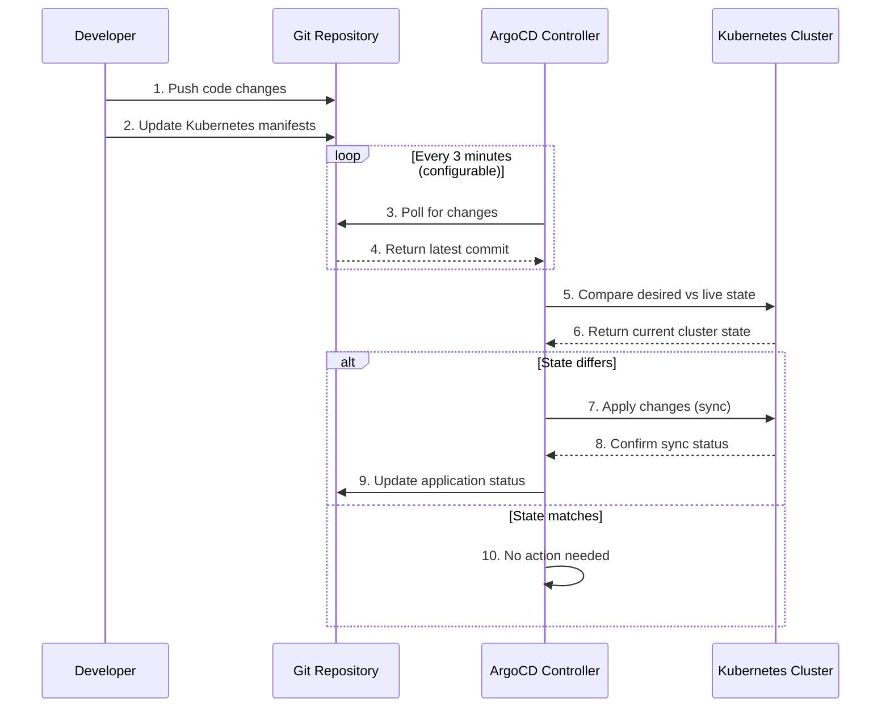
```mermaid
sequenceDiagram
    participant Dev as Developer
    participant Git as Git Repository
    participant ArgoCD as ArgoCD Controller
    participant K8s as Kubernetes Cluster

    Dev->>Git: 1. Push code changes
    Dev->>Git: 2. Update Kubernetes manifests
    
    loop Every 3 minutes (configurable)
        ArgoCD->>Git: 3. Poll for changes
        Git-->>ArgoCD: 4. Return latest commit
    end
    
    ArgoCD->>K8s: 5. Compare desired vs live state
    K8s-->>ArgoCD: 6. Return current cluster state
    
    alt State differs
        ArgoCD->>K8s: 7. Apply changes (sync)
        K8s-->>ArgoCD: 8. Confirm sync status
        ArgoCD->>Git: 9. Update application status
    else State matches
        ArgoCD->>ArgoCD: 10. No action needed
    end
```

#### **Application Sync States**

```mermaid
stateDiagram-v2
    [*] --> OutOfSync: Manifest changes detected
    OutOfSync --> Syncing: Manual/Auto sync triggered
    Syncing --> Synced: Sync successful
    Syncing --> Failed: Sync failed
    Synced --> OutOfSync: New changes in Git
    Failed --> Syncing: Retry sync
    Synced --> [*]: Application deleted

    state OutOfSync {
        [*] --> Unknown: Initial state
        Unknown --> OutOfSync: Git diff detected
    }

    state Syncing {
        [*] --> Progressing: Applying changes
        Progressing --> Terminating: Error occurred
    }
```

#### **ArgoCD Application Resource**

An **Application** is the primary resource in ArgoCD that defines:
- **Source**: Git repository and path containing Kubernetes manifests
- **Destination**: Target Kubernetes cluster and namespace
- **Sync Policy**: How and when to synchronize

```yaml
apiVersion: argoproj.io/v1alpha1
kind: Application
metadata:
  name: my-app
  namespace: argocd
spec:
  project: default
  source:
    repoURL: 'https://github.com/user/repo'
    targetRevision: HEAD
    path: 'k8s-manifests'
  destination:
    server: 'https://kubernetes.default.svc'
    namespace: dev
  syncPolicy:
    automated:
      prune: true      # Delete resources not in Git
      selfHeal: true   # Correct manual changes
    syncOptions:
    - CreateNamespace=true
```

#### **Sync Strategies**

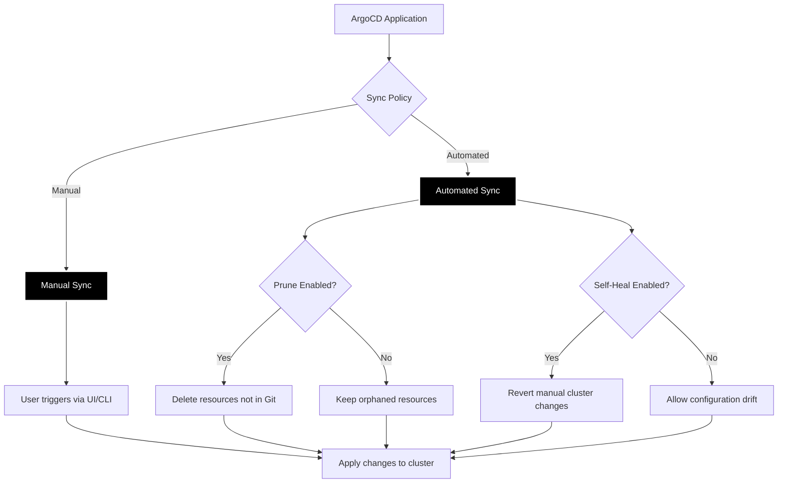
```mermaid
flowchart TD
    App[ArgoCD Application] --> SyncPolicy{Sync Policy}
    
    SyncPolicy -->|Manual| Manual[Manual Sync]
    SyncPolicy -->|Automated| Auto[Automated Sync]
    
    Manual --> ManualTrigger[User triggers via UI/CLI]
    ManualTrigger --> Apply[Apply changes to cluster]
    
    Auto --> AutoPrune{Prune Enabled?}
    AutoPrune -->|Yes| DeleteOrphaned[Delete resources not in Git]
    AutoPrune -->|No| KeepOrphaned[Keep orphaned resources]
    
    Auto --> AutoHeal{Self-Heal Enabled?}
    AutoHeal -->|Yes| RevertManual[Revert manual cluster changes]
    AutoHeal -->|No| AllowDrift[Allow configuration drift]
    
    DeleteOrphaned --> Apply
    KeepOrphaned --> Apply
    RevertManual --> Apply
    AllowDrift --> Apply

    style Auto fill:#000,stroke:#fff,stroke-width:3px,color:#fff
    style Manual fill:#000,stroke:#fff,stroke-width:3px,color:#fff
```

#### **Benefits of ArgoCD**

**1. GitOps Compliance**
- **Single Source of Truth**: Git repository contains complete system state
- **Declarative**: Describe desired state, not deployment procedures
- **Versioned**: Every change tracked with Git commits
- **Auditable**: Complete deployment history in Git logs

**2. Security Enhancements**
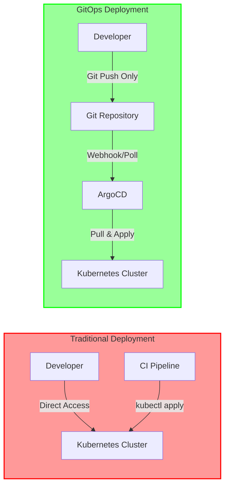
```mermaid
flowchart LR
    subgraph TRADITIONAL["Traditional Deployment"]
        DevT[Developer] -->|Direct Access| ClusterT[Kubernetes Cluster]
        CIT[CI Pipeline] -->|kubectl apply| ClusterT
    end
    
    subgraph GITOPS["GitOps Deployment"]
        DevG[Developer] -->|Git Push Only| GitRepo[Git Repository]
        ArgoCD[ArgoCD] -->|Pull & Apply| ClusterG[Kubernetes Cluster]
        GitRepo -->|Webhook/Poll| ArgoCD
    end
    
    style TRADITIONAL fill:#ff9999,stroke:#ff0000,stroke-width:2px
    style GITOPS fill:#99ff99,stroke:#00ff00,stroke-width:2px
```

**Security Benefits:**
- **No direct cluster access**: Developers only need Git access
- **Credential isolation**: ArgoCD manages cluster credentials
- **Principle of least privilege**: Limited service account permissions
- **Encrypted secrets**: Supports sealed secrets and external secret operators

**3. Multi-Environment & Multi-Cluster Management**

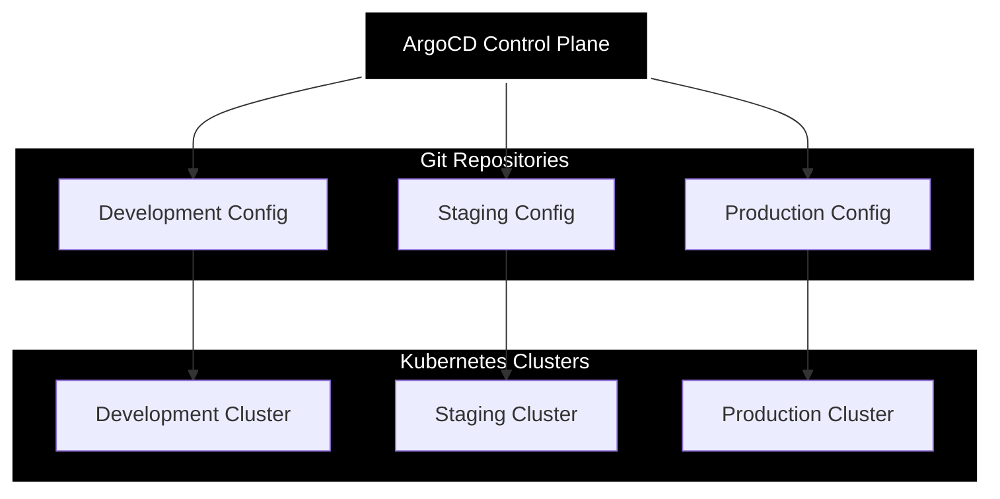
```mermaid
flowchart TD
    ArgoCD[ArgoCD Control Plane]
    
    subgraph REPOS["Git Repositories"]
        DevRepo[Development Config]
        StagingRepo[Staging Config]
        ProdRepo[Production Config]
    end
    
    subgraph CLUSTERS["Kubernetes Clusters"]
        DevCluster[Development Cluster]
        StagingCluster[Staging Cluster]
        ProdCluster[Production Cluster]
    end
    
    ArgoCD --> DevRepo
    ArgoCD --> StagingRepo
    ArgoCD --> ProdRepo
    
    DevRepo --> DevCluster
    StagingRepo --> StagingCluster
    ProdRepo --> ProdCluster

    style ArgoCD fill:#000,stroke:#fff,stroke-width:3px,color:#fff
    style REPOS fill:#000,stroke:#fff,stroke-width:3px,color:#fff
    style CLUSTERS fill:#000,stroke:#fff,stroke-width:3px,color:#fff
```

**4. Disaster Recovery & Rollback**

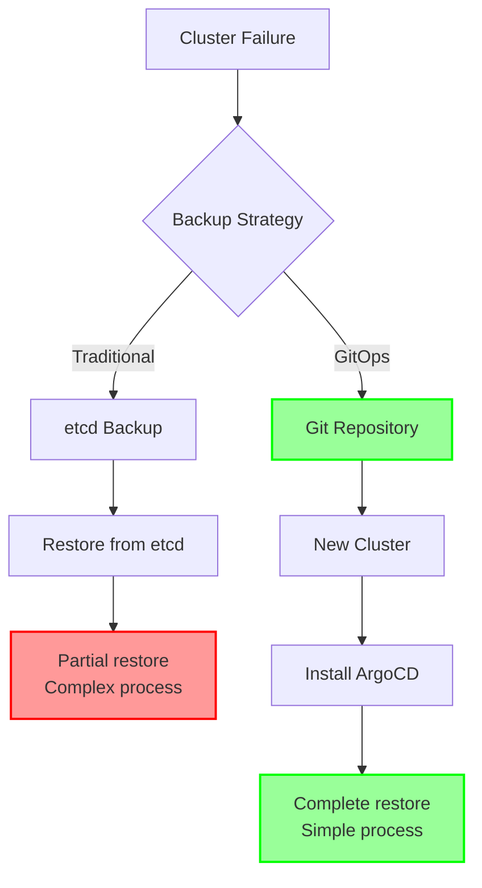
```mermaid
flowchart TD
    Disaster[Cluster Failure] --> Backup{Backup Strategy}
    
    Backup -->|Traditional| ETCDBackup[etcd Backup]
    Backup -->|GitOps| GitRepo[Git Repository]
    
    ETCDBackup --> RestoreETCD[Restore from etcd]
    GitRepo --> NewCluster[New Cluster]
    
    RestoreETCD --> LimitedRestore[Partial restore<br>Complex process]
    NewCluster --> ArgoCD[Install ArgoCD]
    ArgoCD --> FullRestore[Complete restore<br>Simple process]
    
    style GitRepo fill:#99ff99,stroke:#00ff00,stroke-width:2px
    style FullRestore fill:#99ff99,stroke:#00ff00,stroke-width:2px
    style LimitedRestore fill:#ff9999,stroke:#ff0000,stroke-width:2px
```

**Rollback Capabilities:**
- **Git-based rollback**: `git revert` to previous commit
- **Application rollback**: ArgoCD UI/CLI rollback to previous version
- **Automatic rollback**: Configure health checks to trigger automatic rollbacks
- **Blue-green deployments**: Maintain multiple environment branches

#### **Advanced ArgoCD Features**

**1. App of Apps Pattern**

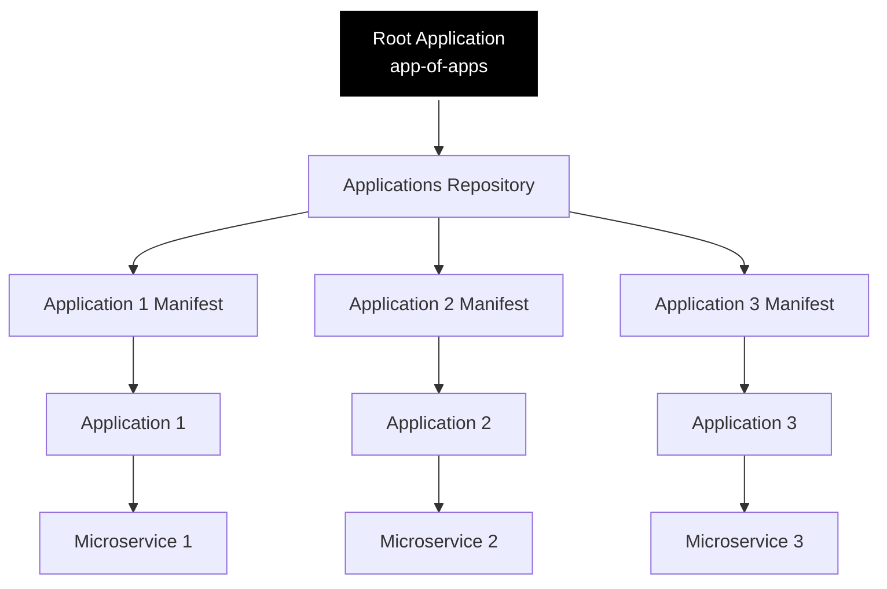
```mermaid
flowchart TD
    RootApp[Root Application<br>app-of-apps] --> AppRepo[Applications Repository]
    
    AppRepo --> App1Manifest[Application 1 Manifest]
    AppRepo --> App2Manifest[Application 2 Manifest]
    AppRepo --> App3Manifest[Application 3 Manifest]
    
    App1Manifest --> App1[Application 1]
    App2Manifest --> App2[Application 2]
    App3Manifest --> App3[Application 3]
    
    App1 --> Service1[Microservice 1]
    App2 --> Service2[Microservice 2]
    App3 --> Service3[Microservice 3]

    style RootApp fill:#000,stroke:#fff,stroke-width:3px,color:#fff
```

**2. Progressive Deployment Strategies**

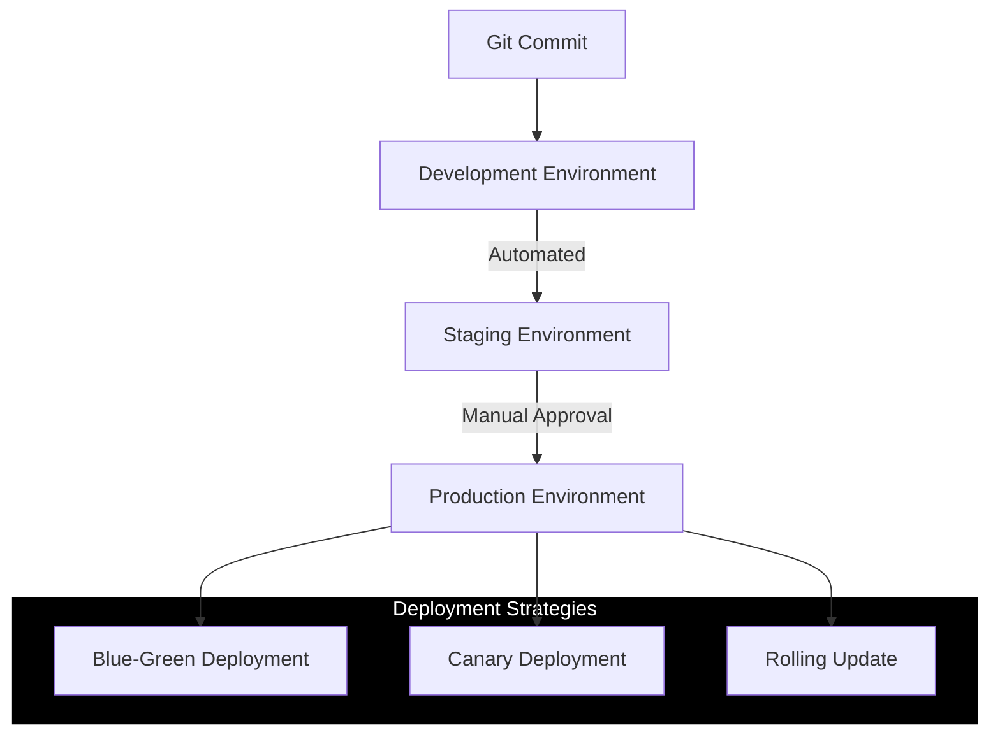
```mermaid
flowchart TD
    GitCommit[Git Commit] --> Dev[Development Environment]
    Dev -->|Automated| Staging[Staging Environment]
    Staging -->|Manual Approval| Prod[Production Environment]
    
    subgraph DEPLOYMENT_STRATEGIES["Deployment Strategies"]
        BlueGreen[Blue-Green Deployment]
        Canary[Canary Deployment]
        RollingUpdate[Rolling Update]
    end
    
    Prod --> BlueGreen
    Prod --> Canary
    Prod --> RollingUpdate

    style DEPLOYMENT_STRATEGIES fill:#000,stroke:#fff,stroke-width:3px,color:#fff
```
## K3d
### what is k3d

K3d is a **lightweight wrapper** that runs K3s (Rancher's minimal Kubernetes distribution) in Docker containers. It makes it incredibly easy to create single and multi-node K3s clusters on your local machine for development and testing.

**Key Characteristics:**
- **Docker-based**: Runs K3s inside Docker containers instead of VMs
- **Lightweight**: Much faster startup than traditional Kubernetes clusters
- **Multi-cluster**: Can run multiple isolated clusters simultaneously
- **Port mapping**: Easy exposure of cluster services to host machine
- **Registry support**: Built-in local registry integration

**Why K3d over other solutions:**
- **Speed**: Cluster creation in seconds vs minutes (compared to minikube/kind)
- **Resource efficient**: Lower memory and CPU footprint
- **CI/CD friendly**: Perfect for automated testing pipelines
- **Multi-cluster**: Test complex scenarios with multiple clusters

### how it works

#### **K3d Architecture**

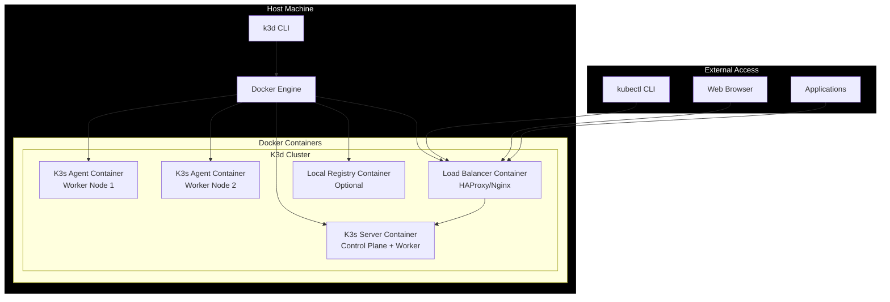
```mermaid
flowchart TD
    subgraph HOST["Host Machine"]
        Docker[Docker Engine]
        K3dCLI[k3d CLI]
        
        subgraph CONTAINERS["Docker Containers"]
            subgraph CLUSTER["K3d Cluster"]
                Server[K3s Server Container<br>Control Plane + Worker]
                Agent1[K3s Agent Container<br>Worker Node 1]
                Agent2[K3s Agent Container<br>Worker Node 2]
                LoadBalancer[Load Balancer Container<br>HAProxy/Nginx]
                Registry[Local Registry Container<br>Optional]
            end
        end
    end
    
    subgraph EXTERNAL["External Access"]
        Kubectl[kubectl CLI]
        Browser[Web Browser]
        Apps[Applications]
    end
    
    %% Connections
    K3dCLI --> Docker
    Docker --> Server
    Docker --> Agent1
    Docker --> Agent2
    Docker --> LoadBalancer
    Docker --> Registry
    
    Kubectl --> LoadBalancer
    LoadBalancer --> Server
    Browser --> LoadBalancer
    Apps --> LoadBalancer

    style HOST fill:#000,stroke:#fff,stroke-width:3px,color:#fff
    style EXTERNAL fill:#000,stroke:#fff,stroke-width:3px,color:#fff
```

#### **Core Components:**

**1. K3s Server Container**
- Runs the complete K3s control plane (API server, scheduler, controller manager)
- Can also act as a worker node (runs kubelet and container runtime)
- Stores cluster state in embedded SQLite (or external datastore)

**2. K3s Agent Containers**
- Additional worker nodes that join the server
- Run kubelet and container runtime (containerd)
- Connect to server via K3s token for authentication

**3. Load Balancer Container**
- HAProxy or Nginx container that proxies traffic to server nodes
- Provides single entry point for kubectl and applications
- Handles high availability when multiple server nodes exist

**4. Local Registry (Optional)**
- Private Docker registry running in container
- Allows pushing/pulling custom images without external registry
- Automatically configured in cluster for seamless image access

#### **K3d vs K3s vs K8s Comparison**

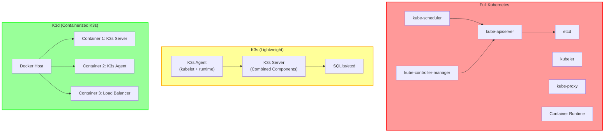
```mermaid
flowchart TD
    subgraph FULL_K8S["Full Kubernetes"]
        K8sAPI[kube-apiserver]
        K8sScheduler[kube-scheduler]
        K8sController[kube-controller-manager]
        K8sETCD[etcd]
        K8sKubelet[kubelet]
        K8sProxy[kube-proxy]
        K8sContainer[Container Runtime]
    end
    
    subgraph K3S["K3s (Lightweight)"]
        K3sServer["K3s Server<br>(Combined Components)"]
        K3sSQLite[SQLite/etcd]
        K3sAgent["K3s Agent<br>(kubelet + runtime)"]
    end
    
    subgraph K3D["K3d (Containerized K3s)"]
        DockerHost[Docker Host]
        K3dContainer1["Container 1: K3s Server"]
        K3dContainer2["Container 2: K3s Agent"]
        K3dLB["Container 3: Load Balancer"]
    end
    
    %% Connections
    K8sAPI --> K8sETCD
    K8sScheduler --> K8sAPI
    K8sController --> K8sAPI
    
    K3sServer --> K3sSQLite
    K3sAgent --> K3sServer
    
    DockerHost --> K3dContainer1
    DockerHost --> K3dContainer2
    DockerHost --> K3dLB

    style FULL_K8S fill:#ff9999,stroke:#ff0000,stroke-width:2px
    style K3S fill:#ffff99,stroke:#ffaa00,stroke-width:2px
    style K3D fill:#99ff99,stroke:#00ff00,stroke-width:2px
```

#### **K3d Cluster Lifecycle**

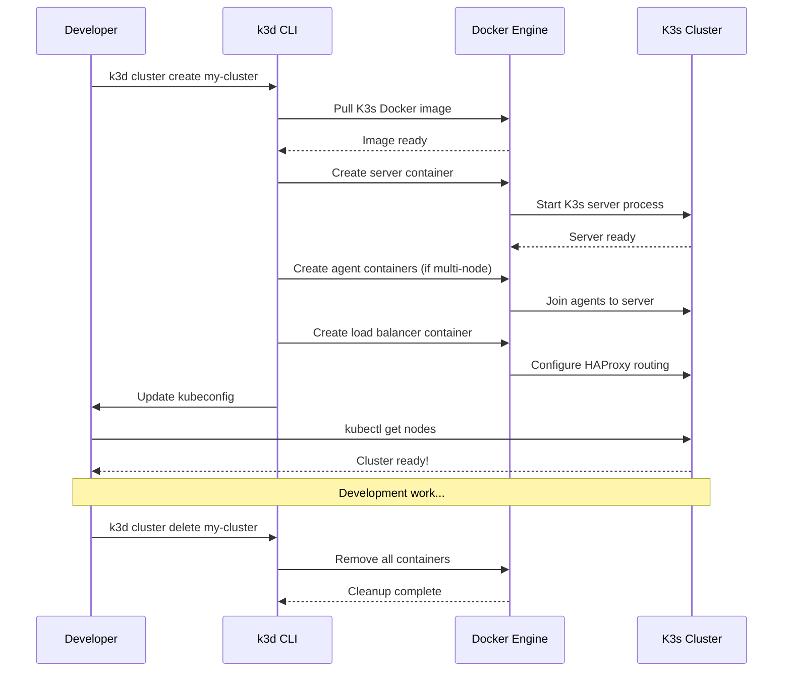
```mermaid
sequenceDiagram
    participant User as Developer
    participant K3d as k3d CLI
    participant Docker as Docker Engine
    participant Cluster as K3s Cluster

    User->>K3d: k3d cluster create my-cluster
    K3d->>Docker: Pull K3s Docker image
    Docker-->>K3d: Image ready
    
    K3d->>Docker: Create server container
    Docker->>Cluster: Start K3s server process
    Cluster-->>Docker: Server ready
    
    K3d->>Docker: Create agent containers (if multi-node)
    Docker->>Cluster: Join agents to server
    
    K3d->>Docker: Create load balancer container
    Docker->>Cluster: Configure HAProxy routing
    
    K3d->>User: Update kubeconfig
    User->>Cluster: kubectl get nodes
    Cluster-->>User: Cluster ready!
    
    Note over User,Cluster: Development work...
    
    User->>K3d: k3d cluster delete my-cluster
    K3d->>Docker: Remove all containers
    Docker-->>K3d: Cleanup complete
```

#### **Port Mapping & Networking**

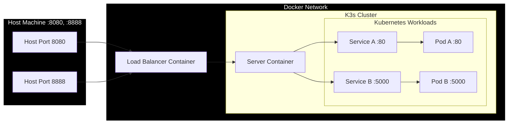
```mermaid
flowchart LR
    subgraph HOST["Host Machine :8080, :8888"]
        HostPort8080[Host Port 8080]
        HostPort8888[Host Port 8888]
    end
    
    subgraph DOCKER["Docker Network"]
        LB[Load Balancer Container]
        
        subgraph K3S_CLUSTER["K3s Cluster"]
            Server[Server Container]
            
            subgraph WORKLOADS["Kubernetes Workloads"]
                Service1[Service A :80]
                Service2[Service B :5000]
                Pod1[Pod A :80]
                Pod2[Pod B :5000]
            end
        end
    end
    
    %% Port mappings
    HostPort8080 --> LB
    HostPort8888 --> LB
    LB --> Server
    Server --> Service1
    Server --> Service2
    Service1 --> Pod1
    Service2 --> Pod2

    style HOST fill:#000,stroke:#fff,stroke-width:3px,color:#fff
    style DOCKER fill:#000,stroke:#fff,stroke-width:3px,color:#fff
```

#### **Key Benefits of K3d:**

**1. Speed & Efficiency**
- Cluster creation: ~10 seconds vs ~5 minutes (minikube)
- Resource usage: ~100MB RAM vs ~2GB RAM (full K8s)
- No hypervisor needed (uses Docker instead of VMs)

**2. Development Workflow**
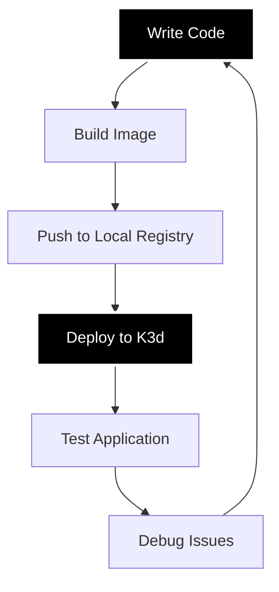
```mermaid
flowchart TD
    Code[Write Code] --> Build[Build Image]
    Build --> Push[Push to Local Registry]
    Push --> Deploy[Deploy to K3d]
    Deploy --> Test[Test Application]
    Test --> Debug[Debug Issues]
    Debug --> Code
    
    style Code fill:#000,stroke:#fff,stroke-width:3px,color:#fff
    style Deploy fill:#000,stroke:#fff,stroke-width:3px,color:#fff
```

**3. Multi-Cluster Testing**
```bash
# Create multiple isolated clusters
k3d cluster create dev-cluster
k3d cluster create staging-cluster
k3d cluster create test-cluster

# Switch between clusters
kubectl config use-context k3d-dev-cluster
kubectl config use-context k3d-staging-cluster
```

**4. CI/CD Integration**
```yaml
# GitHub Actions example
- name: Create k3d cluster
  run: k3d cluster create test-cluster --wait

- name: Deploy application
  run: kubectl apply -f manifests/

- name: Run tests
  run: pytest integration_tests/

- name: Cleanup
  run: k3d cluster delete test-cluster
```

This makes K3d perfect for local development, testing, and CI/CD pipelines where you need fast, lightweight Kubernetes clusters that behave exactly like production clusters but without the overhead.

## Part 1: K3s and Vagrant
We are setting up two virtual machines (nodes) using Vagrant:

1. **Master Node (Server)** – runs K3s in controller mode.

2. **Worker Node (ServerWorker)** – runs K3s in agent mode and joins the master.

Both nodes are on a private network with fixed IPs:

* Master: 192.168.56.110

* Worker: 192.168.56.111

The worker node waits for the master’s node token to join the cluster. Once joined, we can manage the cluster using kubectl from the master.

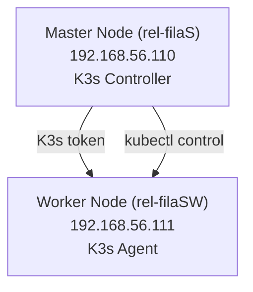
```mermaid
flowchart TD
    %% Nodes
    Master["Master Node (rel-filaS)<br>192.168.56.110<br>K3s Controller"]
    Worker["Worker Node (rel-filaSW)<br>192.168.56.111<br>K3s Agent"]

    %% Connections
    Master -->|K3s token| Worker
    Master -->|kubectl control| Worker
```
## Part 2: K3s and three simple applications
In this part, we set up one virtual machine running K3s in server mode.
On this machine, we deploy three web applications using Kubernetes **Deployments, Services, and Ingress.**

* Each application is a simple Flask web app.

* Application 2 runs with 3 replicas for load balancing.

* An Ingress is configured to route traffic based on the HOST header:

  * `app1.com` → Application 1

  * `app2.com` → Application 2 (3 replicas)

  * `app3.com` → Application 3

This setup allows us to access different applications by visiting the same server IP (`192.168.56.110`) but using different hostnames.

```mermaid
flowchart TD
    Client[Client Browser<br>Any IP]
    MasterNode["rel-filaS - K3s Server<br>192.168.56.110"]

    subgraph K3sApps["K3s Cluster Applications"]
        subgraph App1[App1]
            A1[flask-app1 Pod]
        end

        subgraph App2["App2 (3 Replicas)"]
            A2[flask-app2 Pod 1]
            A3[flask-app2 Pod 2]
            A4[flask-app2 Pod 3]
        end

        subgraph App3[App3]
            A5[flask-app3 Pod]
        end
    end

    %% Connections
    Client -->|"HTTP request (Host: app1.com/app2.com/app3.com)"| MasterNode
    MasterNode -->|"Ingress Controller (Traefik)"| A1
    MasterNode -->|"Ingress Controller (Traefik)"| A2
    MasterNode -->|"Ingress Controller (Traefik)"| A3
    MasterNode -->|"Ingress Controller (Traefik)"| A4
    MasterNode -->|"Ingress Controller (Traefik)"| A5
```
## Part 3: K3d, kubectl and ArgoCD

In this part, we set up a K3d cluster (lightweight K3s in Docker) and deploy ArgoCD for GitOps-based application management.

**Architecture Overview:**

```mermaid
flowchart TD
    subgraph HOST["Host Machine"]
        K3d[K3d Cluster Manager]
        Docker[Docker Engine]
        
        subgraph K3D_CLUSTER["K3d Cluster (iot-cluster)"]
            subgraph ARGOCD_NS["argocd namespace"]
                ArgoCDServer[ArgoCD Server]
                RepoServer[Repository Server]
                AppController[Application Controller]
                Redis[Redis Cache]
            end
            
            subgraph DEV_NS["dev namespace"]
                App[T2O Application<br>broly20/flask-app-p3:v2]
            end
        end
    end
    
    subgraph EXTERNAL["External Access"]
        WebUI[ArgoCD Web UI<br>localhost:30002]
        AppUI[Application UI<br>localhost:30001]
    end
    
    subgraph GIT["Git Repository"]
        Manifests[Kubernetes Manifests<br>deployment.yaml<br>namespaces.yaml]
    end
    
    %% Connections
    K3d --> Docker
    Docker --> K3D_CLUSTER
    ArgoCDServer --> RepoServer
    ArgoCDServer --> AppController
    AppController --> App
    RepoServer --> Manifests
    WebUI --> ArgoCDServer
    AppUI --> App

    style HOST fill:#000,stroke:#fff,stroke-width:3px,color:#fff
    style EXTERNAL fill:#000,stroke:#fff,stroke-width:3px,color:#fff
    style GIT fill:#000,stroke:#fff,stroke-width:3px,color:#fff
```

### Setup Components:

#### **1. K3d Cluster Setup**
- **K3d**: Runs K3s (lightweight Kubernetes) inside Docker containers
- **Cluster Name**: `iot-cluster`
- **Port Mapping**: Maps cluster ports to host for external access

#### **2. ArgoCD Installation**
- **Namespace**: `argocd` - dedicated namespace for ArgoCD components
- **Components**: API Server, Repository Server, Application Controller, Redis
- **Access**: NodePort service exposes ArgoCD UI on localhost:30002

#### **3. Application Deployment**
- **Namespace**: `dev` - application deployment namespace
- **Image**: `broly20/flask-app-p3:v2` - Flask web application
- **Replicas**: 1 pod with resource limits and health checks
- **Service**: NodePort on port 30001 (accessible via localhost:30001)

### GitOps Workflow:

```mermaid
sequenceDiagram
    participant Dev as Developer
    participant Git as GitHub Repository
    participant ArgoCD as ArgoCD Application Controller
    participant K3d as K3d Cluster

    Dev->>Git: 1. Push YAML manifests to p3/ folder
    Note over Git: deployment.yaml, namespaces.yaml
    
    loop Every 3 minutes
        ArgoCD->>Git: 2. Poll repository for changes
        Git-->>ArgoCD: 3. Return latest commit SHA
    end
    
    ArgoCD->>K3d: 4. Compare desired vs actual state
    K3d-->>ArgoCD: 5. Return current pod/service status
    
    alt Configuration differs
        ArgoCD->>K3d: 6. Apply new manifests
        K3d-->>ArgoCD: 7. Confirm deployment status
        Note over ArgoCD: Update application health
    else No changes
        ArgoCD->>ArgoCD: 8. Maintain current state
    end
```

### Deployment Process:

1. **Infrastructure Setup**: Run `install_dependencies.sh` to install Docker, kubectl, k3d, and ArgoCD CLI
2. **Cluster Creation**: Execute `create_cluster.sh` to:
   - Create K3d cluster with port mappings
   - Apply namespace configurations
   - Install ArgoCD in the cluster
   - Deploy ArgoCD NodePort service
   - Create ArgoCD Application resource
3. **GitOps Sync**: ArgoCD automatically syncs the application from the Git repository

### Key Features Demonstrated:

1. **GitOps Principle**: All configuration stored in Git repository (`p3` folder)
2. **Automated Sync**: ArgoCD automatically detects and applies changes from Git
3. **Self-Healing**: Manual cluster changes are reverted to match Git state
4. **Resource Management**: Proper namespacing, resource limits, health checks
5. **External Access**: Both ArgoCD UI and application accessible from host machine

### Configuration Files:

- **`namespaces.yaml`**: Creates `argocd` and `dev` namespaces
- **`deployment.yaml`**: Defines the Flask application deployment and NodePort service
- **`argocd-nodeport.yaml`**: Exposes ArgoCD UI via NodePort on port 30002
- **`argocd-app.yaml`**: ArgoCD Application resource that tracks the Git repository

### Access URLs:
- **ArgoCD Dashboard**: `http://localhost:30002`
- **T2O Application**: `http://localhost:30001`

This setup demonstrates a complete GitOps pipeline where infrastructure and applications are managed declaratively through Git, providing automated deployment, rollback capabilities, and full audit trails. The K3d approach makes it lightweight and perfect for development and testing scenarios.

