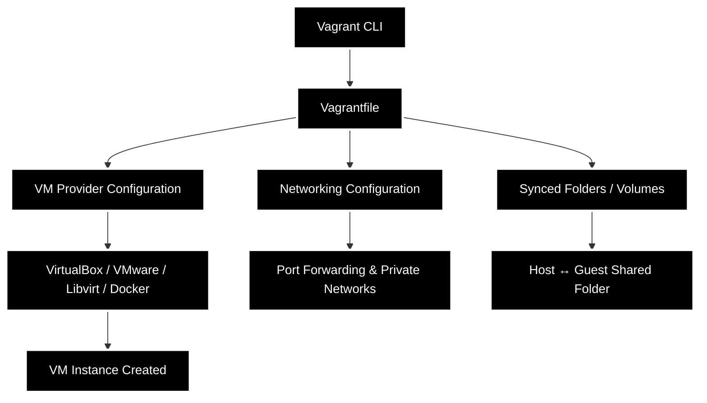
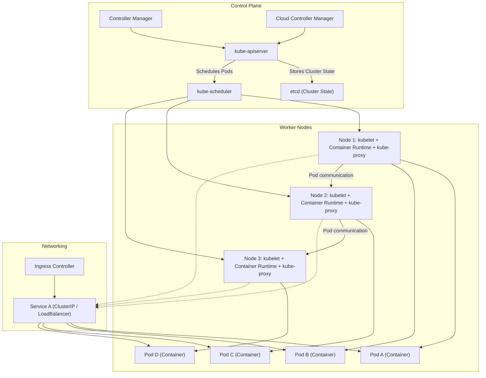
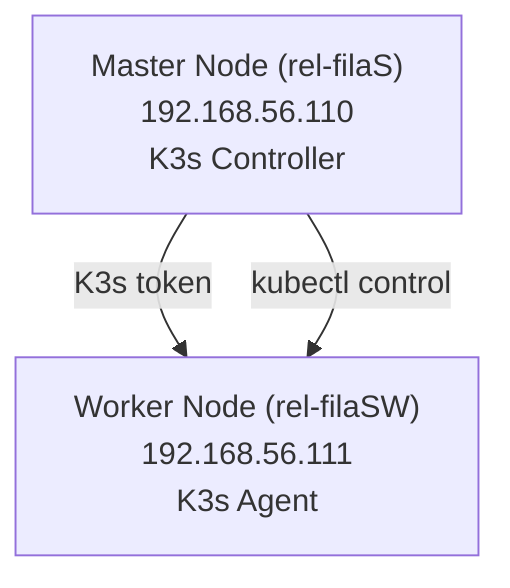

# Inception of Things (Part 1)

## Description
This project aims to introduce you to Kubernetes from a developer's perspective. You will have to set up small clusters and discover the mechanics of continuous integration. At the end of this project, you will be able to set up a working cluster in Docker and have a usable continuous integration pipeline for your applications.

## Vagrant
Vagrant is the command line utility for managing the lifecycle of virtual machines. Isolate dependencies and their configuration within a single disposable and consistent environment.

## kurbernetes (k8s)
is an open-source platform for automating deployment, scaling, and operation of containerized applications.

Key ideas:
* It manages containers across multiple machines.
* Ensures high availability and scalability.
* Provides self-healing (restart containers if they fail, reschedule them if nodes die).
* Offers service discovery and load balancing automatically.

### Kubernetes Architecture Overview
#### Control Plane (Master)
It manages the cluster state.

Key components:
1. **API Server (kube-apiserver)**:
The front door of Kubernetes.
Receives REST API requests (from kubectl, other components).
Validates and processes requests.
2. **etcd**:
A key-value store for Kubernetes cluster state.
Stores configurations, cluster state, secrets, etc.
Think of it as the cluster’s memory.
3. **Controller Manager (kube-controller-manager)**:
* Ensures desired state matches the actual state.
* Controllers include:
  * Node Controller → monitors node health.
  * Replication Controller → ensures correct number of pods.
  * Endpoint Controller → manages network endpoints.
4. **Scheduler (kube-scheduler):**
* Assigns workloads (pods) to nodes.
* Decides which node can run a pod based on resources, policies, and constraints.
5. **Cloud Controller Manager (optional if using cloud)**:
* Integrates cloud-specific services (like AWS, GCP, Azure).
* Manages load balancers, node lifecycles, storage, etc.

#### Node (Worker) Plane
Nodes are where your applications actually run.

Key components:
1. **kubelet**:
* Agent running on each node.
* Communicates with API server.
* Ensures containers in pods are running.

2. **Container Runtime**:
* Software that runs containers (Docker, containerd, CRI-O).
* Kubelet uses this to launch containers.

3. **kube-proxy**:
* Handles networking for pods.
* Implements service abstraction and load balancing.
* Ensures pods can communicate inside and outside the cluster.

4. **Pods**:
* Smallest deployable unit in Kubernetes.
* A pod can contain one or more containers.
* Pods are ephemeral (they can die and be recreated).

### Kubernetes Objects
Objects are persistent entities in Kubernetes. They describe the desired state.

1. **Pod** → Single/multi-container unit.

2. **ReplicaSet** → Ensures certain number of pod replicas exist.

3. **Deployment** → Declarative way to manage ReplicaSets and rollouts.

4. **StatefulSet** → Manages stateful applications (like databases).

5. **DaemonSet** → Runs a pod on every node (useful for logging, monitoring).

6. **Service** → Provides stable IPs and DNS for pods, load balancing.

7. **ConfigMap** & Secret → Store configuration and sensitive info.

8. **Ingress** → Exposes HTTP/HTTPS routes to services from outside.

### Kubernetes Networking
Kubernetes networking has 3 fundamental rules:
1. Every pod gets a unique IP.

2. Pods can communicate with other pods without NAT.

3. Agents (like kube-proxy) handle service IPs and load balancing.

**Networking components:**
* **Pod network** → Direct communication between pods.

* **Service network** → Load-balances traffic to pods.

* **Ingress controller** → Manages external HTTP/S traffic.

* **CNI plugins** → Networking solutions like Calico, Flannel, Weave, etc.

**Traffic flow examples:**
* **Pod** → **Pod**: direct IP routing.

* **Pod** → **Service**: kube-proxy redirects traffic to available pods.

* **External** → **Service** → Pod: via NodePort or LoadBalancer or Ingress.

### Kubernetes Workflow
Here’s a high-level view of how Kubernetes manages workloads:

1. Developer creates a Deployment object (desired state) via API Server.

2. Scheduler decides which node should run the pods.

3. kubelet on the node instructs the container runtime to launch containers.

4. Controller Manager ensures the number of pods matches the desired replicas.

5. kube-proxy ensures networking and service discovery.

6. If a pod dies:

   * Controller Manager notices and requests API server to recreate it.

   * Scheduler finds a node to launch a new pod.

7. etcd always stores the current state for recovery.

### High-Level Diagram (Mermaid)

## kurbernetes (k8s) Simplified Diagram

## K3S
K3s is a highly available, certified Kubernetes distribution designed for production workloads in unattended, resource-constrained, remote locations or inside IoT appliances.
### K3s Architecture Overview
K3s keeps Kubernetes’ core concepts but merges or simplifies components.

1. **Control Plane**: Server (Control Plane node):

* Combines API Server, Scheduler, Controller Manager, and etcd (or SQLite by default).

* Optionally runs embedded datastore (SQLite) instead of external etcd.

* Single node can act as master and worker for small setups.

2. **Worker Nodes**: Agent Node:

* Runs kubelet + container runtime.

* Communicates with the K3s server to run pods.

K3s defaults to containerd instead of Docker for running containers.

## Part 1: K3s and Vagrant
We are setting up two virtual machines (nodes) using Vagrant:

1. **Master Node (Server)** – runs K3s in controller mode.

2. **Worker Node (ServerWorker)** – runs K3s in agent mode and joins the master.

Both nodes are on a private network with fixed IPs:

* Master: 192.168.56.110

* Worker: 192.168.56.111

The worker node waits for the master’s node token to join the cluster. Once joined, we can manage the cluster using kubectl from the master.

