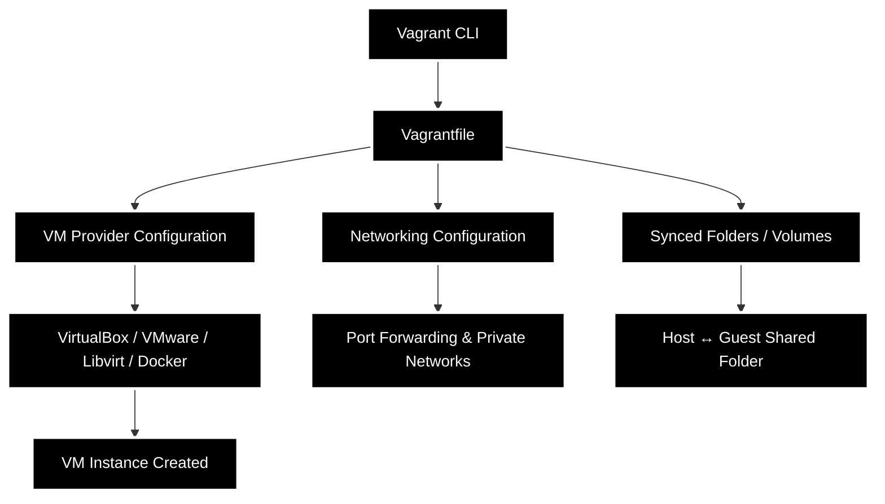

# Inception of Things 

## Description
This project aims to introduce you to Kubernetes from a developer's perspective. You will have to set up small clusters and discover the mechanics of continuous integration. At the end of this project, you will be able to set up a working cluster in Docker and have a usable continuous integration pipeline for your applications.

## Vagrant
Vagrant is the command line utility for managing the lifecycle of virtual machines. Isolate dependencies and their configuration within a single disposable and consistent environment.

## kurbernetes