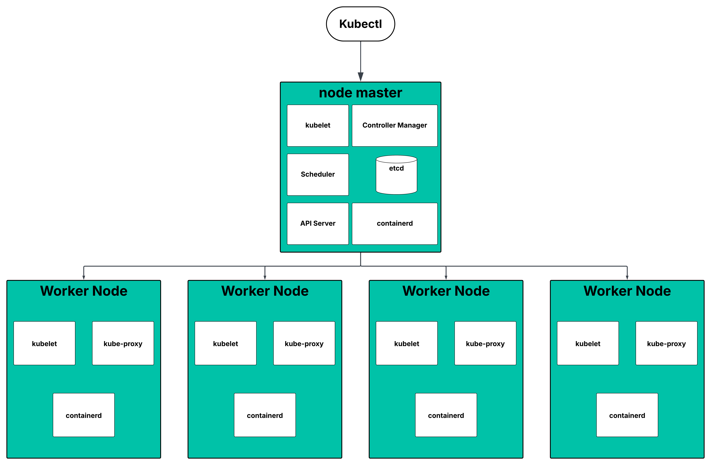

# Inception of Things


## Description
This project aims to introduce you to Kubernetes from a developer's perspective. You will have to set up small clusters and discover the mechanics of continuous integration. At the end of this project, you will be able to set up a working cluster in Docker and have a usable continuous integration pipeline for your applications.

## Vagrant
Vagrant is the command line utility for managing the lifecycle of virtual machines. Isolate dependencies and their configuration within a single disposable and consistent environment.


## kurbernetes (k8s)
is an open-source platform for automating deployment, scaling, and operation of containerized applications.

Key ideas:
* It manages containers across multiple machines.
* Ensures high availability and scalability.
* Provides self-healing (restart containers if they fail, reschedule them if nodes die).
* Offers service discovery and load balancing automatically.

### Kubernetes Architecture Overview
#### Control Plane (Master)
It manages the cluster state.

Key components:
1. **API Server (kube-apiserver)**:
The front door of Kubernetes.
Receives REST API requests (from kubectl, other components).
Validates and processes requests.
2. **etcd**:
A key-value store for Kubernetes cluster state.
Stores configurations, cluster state, secrets, etc.
Think of it as the cluster’s memory.
3. **Controller Manager (kube-controller-manager)**:
* Ensures desired state matches the actual state.
* Controllers include:
  * Node Controller → monitors node health.
  * Replication Controller → ensures correct number of pods.
  * Endpoint Controller → manages network endpoints.
4. **Scheduler (kube-scheduler):**
* Assigns workloads (pods) to nodes.
* Decides which node can run a pod based on resources, policies, and constraints.
5. **Cloud Controller Manager (optional if using cloud)**:
* Integrates cloud-specific services (like AWS, GCP, Azure).
* Manages load balancers, node lifecycles, storage, etc.

#### Node (Worker) Plane
Nodes are where your applications actually run.

Key components:
1. **kubelet**:
* Agent running on each node.
* Communicates with API server.
* Ensures containers in pods are running.

2. **Container Runtime**:
* Software that runs containers (Docker, containerd, CRI-O).
* Kubelet uses this to launch containers.

3. **kube-proxy**:
* Handles networking for pods.
* Implements service abstraction and load balancing.
* Ensures pods can communicate inside and outside the cluster.

4. **Pods**:
* Smallest deployable unit in Kubernetes.
* A pod can contain one or more containers.
* Pods are ephemeral (they can die and be recreated).

### Kubernetes Objects
Objects are persistent entities in Kubernetes. They describe the desired state.

1. **Pod** → Single/multi-container unit.

2. **ReplicaSet** → Ensures certain number of pod replicas exist.

3. **Deployment** → Declarative way to manage ReplicaSets and rollouts.

4. **StatefulSet** → Manages stateful applications (like databases).

5. **DaemonSet** → Runs a pod on every node (useful for logging, monitoring).

6. **Service** → Provides stable IPs and DNS for pods, load balancing.

7. **ConfigMap** & Secret → Store configuration and sensitive info.

8. **Ingress** → Exposes HTTP/HTTPS routes to services from outside.

### Kubernetes Networking
Kubernetes networking has 3 fundamental rules:
1. Every pod gets a unique IP.

2. Pods can communicate with other pods without NAT.

3. Agents (like kube-proxy) handle service IPs and load balancing.

**Networking components:**
* **Pod network** → Direct communication between pods.

* **Service network** → Load-balances traffic to pods.

* **Ingress controller** → Manages external HTTP/S traffic.

* **CNI plugins** → Networking solutions like Calico, Flannel, Weave, etc.

**Traffic flow examples:**
* **Pod** → **Pod**: direct IP routing.

* **Pod** → **Service**: kube-proxy redirects traffic to available pods.

* **External** → **Service** → Pod: via NodePort or LoadBalancer or Ingress.

### Kubernetes Workflow
Here’s a high-level view of how Kubernetes manages workloads:

1. Developer creates a Deployment object (desired state) via API Server.

2. Scheduler decides which node should run the pods.

3. kubelet on the node instructs the container runtime to launch containers.

4. Controller Manager ensures the number of pods matches the desired replicas.

5. kube-proxy ensures networking and service discovery.

6. If a pod dies:

   * Controller Manager notices and requests API server to recreate it.

   * Scheduler finds a node to launch a new pod.

7. etcd always stores the current state for recovery.


### High-Level Diagram (Mermaid)


## kurbernetes (k8s) Simplified Diagram


## K3S
K3s is a highly available, certified Kubernetes distribution designed for production workloads in unattended, resource-constrained, remote locations or inside IoT appliances.
### K3s Architecture Overview
K3s keeps Kubernetes’ core concepts but merges or simplifies components.

1. **Control Plane**: Server (Control Plane node):

* Combines API Server, Scheduler, Controller Manager, and etcd (or SQLite by default).

* Optionally runs embedded datastore (SQLite) instead of external etcd.

* Single node can act as master and worker for small setups.

2. **Worker Nodes**: Agent Node:

* Runs kubelet + container runtime.

* Communicates with the K3s server to run pods.

K3s defaults to containerd instead of Docker for running containers.


## Kubernetes YAML File Explained 
each configuration file in kubernetes usually has 3 main parts:

the first one is the metadata. this section describes basic info about the object you are creating like its name, namespace, and any labels or annotations you want to attach. metadata is mostly just identification and organization.

the second part is the specification (written as spec). this is where you actually tell kubernetes what you want the object to look like. for example, in a deployment spec you can say how many replicas you want, which container image to use, what ports should be exposed, and so on. basically, spec is the “desired state.”

the third part is the status. unlike the other two, you don’t write this part yourself. kubernetes generates it automatically when the resource runs. it shows the “current state” of the object and it is continuously updated. kubernetes always compares the status against the spec (the desired state) and makes changes to bring the cluster into alignment. all of this info is stored in etcd, the internal database that kubernetes uses.

---
what is deployment ??

a deployment is a kubernetes object that manages pods for you. instead of creating pods directly, you define a deployment and kubernetes takes care of creating them, restarting them if they fail, and keeping the right number of replicas running.

in the configuration file, a deployment has a template section. this template is basically a pod definition nested inside the deployment. it describes things like the container image to run, its name, which ports it opens, and the labels it uses.

labels are super important here: they’re how kubernetes keeps track of which pods belong to which deployment. if you scale a deployment from 2 replicas to 5, kubernetes will spin up new pods with the same labels as the template.

an example deployment yaml:

```yaml
apiVersion: apps/v1
kind: Deployment
metadata:
  name: my-app-deployment
  labels:
    app: my-app
spec:
  replicas: 3
  selector:
    matchLabels:
      app: my-app
  template:
    metadata:
      labels:
        app: my-app
    spec:
      containers:
      - name: my-app-container
        image: nginx:latest
        ports:
        - containerPort: 80
```
and for the selector part, it is mainly used in a service configuration to link (or better yet, match) it to a deployment’s pods. when you create a service, you tell it which pods it should send traffic to by giving it a selector that matches the pod labels.

in addition to the selector, the service also configures ports: which port it will listen on and which port inside the pod it should forward requests to.

an example service yaml:
```yaml
apiVersion: v1
kind: Service
metadata:
  name: my-app-service
spec:
  selector:
    app: my-app
  ports:
    - protocol: TCP
      port: 80        # port exposed by the service
      targetPort: 80  # port inside the pod
  type: ClusterIP     # exposes internally within the cluster
```
---
a simple diagram showing how all these pieces connect together:


<!-- each configuration file in kubernetes has 3 part
The first one is the **Metadata** and the second part is **specification** the first lines are youst a description of whaat you want to create. and the third part would be **status** and its automatically generated and added by kubernetes after the run and its compared to that saved stat in etcd and the status is updated continuously 

what is deployment ??
deployment manages the pods that are below them and in the configuration file is have a template part which in itself holds the configuration file for pods that it manages and these information are what ports are open on a container and what is its name and so on also we use labels to track the pods that are created by a certain deployment 

and for the selector part its mainly used on a service config to link it or better yet match it to a deployment another thing that is configured is the ports of the services which ports it will forward the request to and which port it will receive requests in.  -->

## Part 1: K3s and Vagrant
We are setting up two virtual machines (nodes) using Vagrant:

1. **Master Node (Server)** – runs K3s in controller mode.

2. **Worker Node (ServerWorker)** – runs K3s in agent mode and joins the master.

Both nodes are on a private network with fixed IPs:

* Master: 192.168.56.110

* Worker: 192.168.56.111

The worker node waits for the master’s node token to join the cluster. Once joined, we can manage the cluster using kubectl from the master.


## Part 2: K3s and three simple applications
In this part, we set up one virtual machine running K3s in server mode.
On this machine, we deploy three web applications using Kubernetes **Deployments, Services, and Ingress.**

* Each application is a simple Flask web app.

* Application 2 runs with 3 replicas for load balancing.

* An Ingress is configured to route traffic based on the HOST header:

  * `app1.com` → Application 1

  * `app2.com` → Application 2 (3 replicas)

  * `app3.com` → Application 3

This setup allows us to access different applications by visiting the same server IP (`192.168.56.110`) but using different hostnames.


